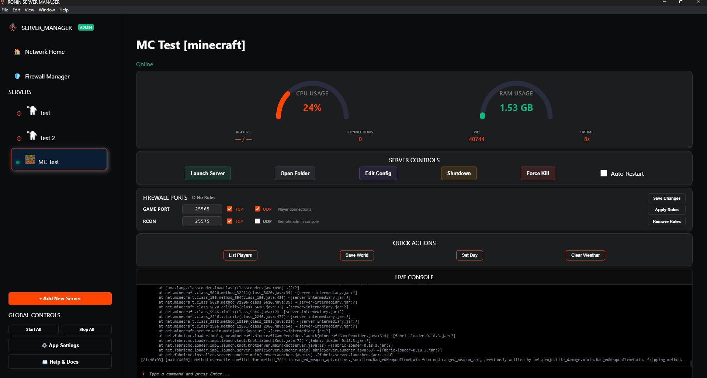
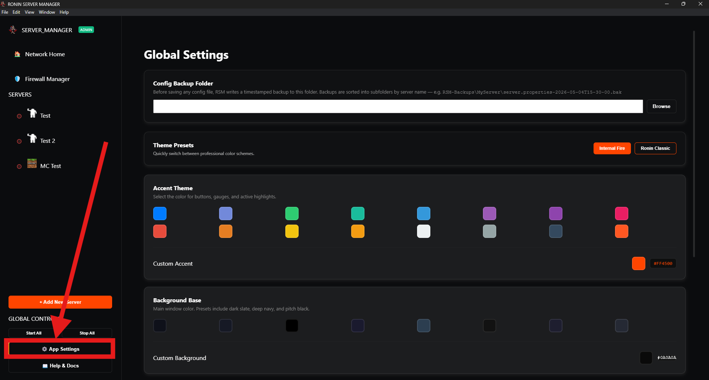
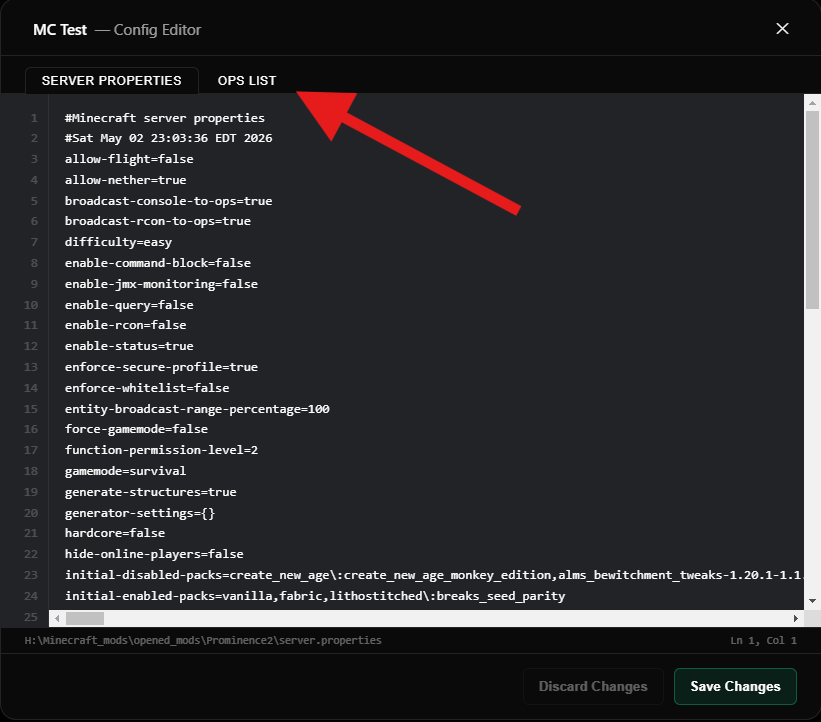
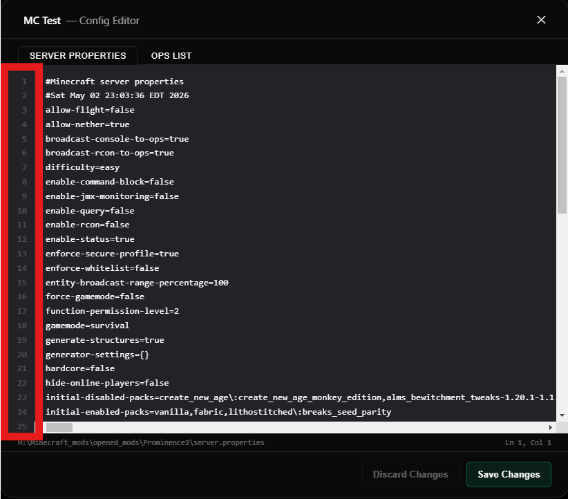
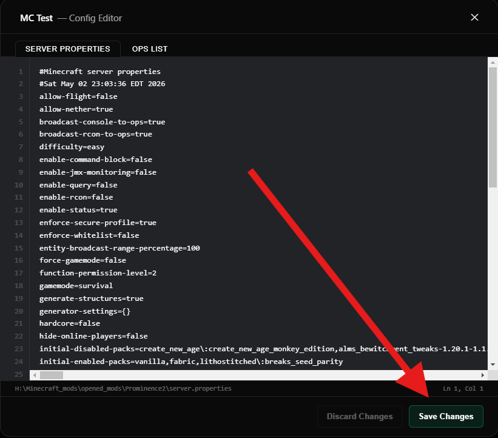
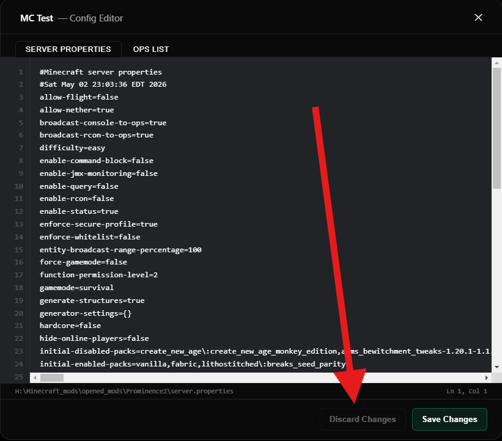
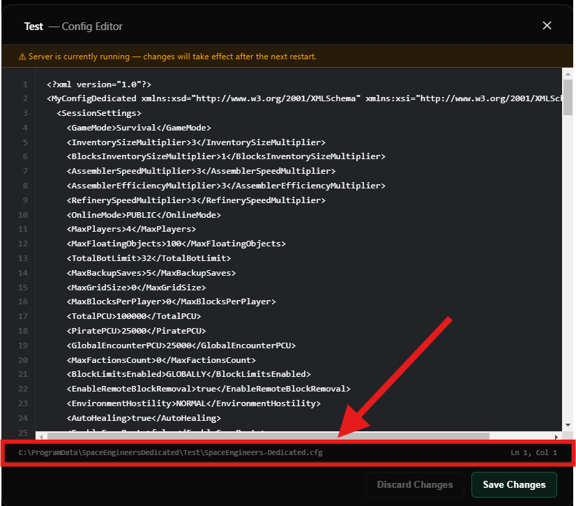
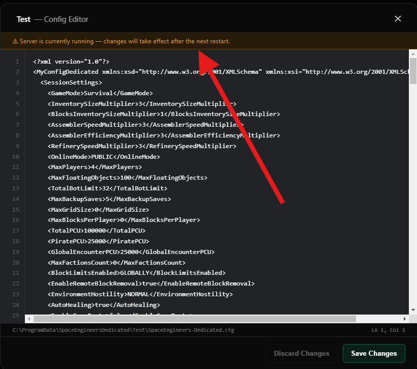

# <p style="text-align: center; text-shadow: 0 0 15px rgba(255,69,0,0.5);">🚀 Getting Started</p>

This guide walks you through everything from downloading RSM to editing your first config file. Follow it top to bottom on a fresh install and you'll have a server running in under ten minutes.

---

## <p style="text-align: center; text-shadow: 0 0 15px rgba(255,69,0,0.5);">📥 Step 1 — Download & Install</p>

1. Head to the [Releases](https://github.com/PhonicSpider/Ronin-Server-Manager/releases) page and download the latest `.exe` installer.
2. Run the installer. If Windows SmartScreen warns you, click **More info → Run anyway** — this is expected for unsigned community software.
3. RSM will launch automatically once the install finishes.

!!! tip "No admin required for most servers"
    RSM only needs administrator rights for games that bind to privileged network ports (Space Engineers uses the VRage HTTP API on port 80 by default). A green **Admin** badge appears in the top-left corner of the app when it has elevated privileges.

---

## <p style="text-align: center; text-shadow: 0 0 15px rgba(255,69,0,0.5);">🏠 Step 2 — First Launch</p>

When RSM opens you'll land on the **Home** view. This is the nerve centre of the app — it shows the combined CPU and RAM used by all your managed servers, a live system log at the bottom, and quick global controls at the top.

<div class="grid cards" markdown>

-   :material-view-dashboard: **Home**

    ---

    Aggregate CPU/RAM gauges and a scrolling system log. This is your main way to see what going on with the application. It will not show specific server information, but if you are trying to troubleshoot an issue, this is where to start.

    

-   :material-server: **Manager**

    ---

    Individual server controls — console, resource gauges, Quick Actions, and the Edit Config button. Switch to this view by clicking a server in the sidebar.

    

-   :material-cog: **Settings**

    ---

    Theme customisation and app behaviour options. Reachable via the **⚙️ App Settings** button at the bottom of the sidebar.

    

</div>

The sidebar on the left lists every server you've added. It starts empty — that's fine, you'll add one in Step 4.

---

## <p style="text-align: center; text-shadow: 0 0 15px rgba(255,69,0,0.5);">⚙️ Step 3 — Configure Your Settings</p>

Open **⚙️ App Settings** in the sidebar before you do anything else. Two things are worth setting up now.

### 🗂️ Config Backup Folder

Every time you save a file in the in-app config editor, RSM writes a timestamped backup before overwriting anything. This is where those backups land.

- The default is `Desktop\RSM-Files\RSM-Backups` and is set automatically on first launch.
- Click **Browse** to point it somewhere else — an external drive, a cloud-synced folder, or a dedicated backup location.
- Backups are organised by server name automatically:

```
RSM-Backups\
  MyMinecraftServer\
    server.properties-2026-05-04T15-30-00.bak
  ArkServer\
    GameUserSettings.ini-2026-05-04T18-00-00.bak
```

!!! info "Automatic setup"
    RSM sets `Desktop\RSM-Files\RSM-Backups` as the default on first launch and creates the folder automatically, and will create a folder for the specific server once a file is saved. You only need to change it if you'd prefer backups stored somewhere else. The only time backups can fail is if you've changed the path to a drive or network share that isn't available.

### 🎨 Theme

RSM ships with two theme presets and full custom controls below them.

=== "Presets"

    | Preset | Accent | Background | Best for |
    |---|---|---|---|
    | **Internal Fire** | `#ff4500` deep orange | Near-black `#0a0a0a` | The "Dark Mode" look |
    | **Ronin Classic** | `#007bff` blue | Dark navy `#0f111a` | A cooler, more neutral feel |

    Click either button in the **Theme Presets** card to apply instantly.

=== "Custom"

    Three independent controls sit below the presets:

    - **Accent** — buttons, gauges, active highlights, and the modified-file dot in the config editor
    - **Background Base** — the main window colour; choose from the preset swatches or use the colour picker
    - **Text Color** — primary label and description colour
    - **Window Glass Strength** — opacity slider; lower values give the UI a translucent feel if you're running a wallpaper behind it

    All choices are saved to local storage and persist across restarts.

### 🖥️ System Behaviour

- **Launch Manager on Windows Startup** — toggle this on if you want RSM to open automatically when your machine boots. Useful for always-on server hosts.

---

## <p style="text-align: center; text-shadow: 0 0 15px rgba(255,69,0,0.5);">➕ Step 4 — Add Your First Server</p>

Before adding a server to RSM, make sure it has been launched manually at least once and starts without errors. RSM manages servers — it does not install or configure them... *yet*.

1. Click **+ Add New Server** in the sidebar.
2. Pick your game from the card grid.
3. Fill in the wizard fields — what each one means is covered in the [Server Setup Overview](servers/index.md).
4. Click **Save Configuration**. The server appears in the sidebar immediately.

!!! info "Not sure which fields to fill in?"
    Every game type has its own setup guide under **Server Setup** in the left navigation. Each guide explains the exact paths to look for and any game-specific quirks. If your server is not listed in the guide, don't worry. RSM will still be able to manage it!

    First, send us a message in discord or in the discussions and we can see about adding the game as one that can be selected. *(if you know coding or how the server is set up, you can do it too through github! notes on how to are in the "[Contributing](contributing.md)" page)*

    Second, just select **"Other"** when choosing your game type. It will show all fields that RSM is able to save to run a server. Fill out as best you can based on the info provided here and RSM will handle the rest for you!

---

## <p style="text-align: center; text-shadow: 0 0 15px rgba(255,69,0,0.5);">✏️ Step 5 — The Config Editor</p>

Once a server is added, click it in the sidebar to open the **Manager** view, then click **Edit Config** in the control bar. This opens the in-app config editor without touching a file manager.

<div class="grid cards" markdown>

-   :material-file-document-edit: **Tabs**

    ---

    Games with more than one config file (Ark, Minecraft) show a tab bar at the top. Switching tabs with unsaved changes will prompt you to confirm before discarding.

    

-   :material-numeric: **Line Numbers**

    ---

    Line numbers are shown on the left gutter and a **Ln / Col** counter sits in the bottom-right corner, updating as you move the cursor.

    

-   :material-content-save: **Saving**

    ---

    Click **Save Changes** or press **Ctrl+S**. A backup is written first, then the file is overwritten. The status bar confirms both: `✓ Saved · backup created`.

    

-   :material-undo: **Discarding**

    ---

    **Discard Changes** reverts to the last loaded state. The button is greyed out when there's nothing to discard.

    

-   :material-folder-open: **Open Folder**

    ---

    Click the grey file path at the bottom of the editor to open the containing folder in Explorer — useful for dropping in extra files or checking a backup.

    

-   :material-alert: **Running Server Warning**

    ---

    A yellow banner appears at the top if the server is currently online. You can still edit and save, but changes won't take effect until the server restarts.

    

</div>

### Keyboard Shortcuts

| Key | Action |
|---|---|
| `Ctrl+S` | Save the current file |
| `Esc` | Close the editor (prompts if unsaved changes exist) |

---

## <p style="text-align: center; text-shadow: 0 0 15px rgba(255,69,0,0.5);">⚡ Quick Actions</p>

Minecraft, Space Engineers, and Ark each have a set of **Quick Action** buttons that appear below the server controls when a server is online. These fire common commands (save world, list players, kick, etc.) without typing anything in the console.

Quick Actions are only active while the server is running. They appear automatically for supported game types — no configuration needed.

If you know of any common commands for a server type that may be useful to add to this bar, let us know in discussions or in the discord and we can look into adding them!

---

## <p style="text-align: center; text-shadow: 0 0 15px rgba(255,69,0,0.5);">🗺️ Roadmap</p>

RSM is actively being developed. It may take a while, but here's what's planned for the future of RSM:

<div class="grid cards" markdown>

-   :material-controller: **Expanded Game Support**

    ---

    More game types added continuously as the community requests them. Each addition brings a dedicated setup guide, config editor support, and Quick Actions.

-   :material-download-circle: **One-Click Server Provisioning**

    ---

    Select a game type and RSM downloads the server files automatically, saves them alongside your backups, opens the config editor, and walks you through the setup wizard — all in one flow.

-   :material-router-wireless: **Ronin Portier Integration**

    ---

    Automatic port forwarding via **Ronin Portier** when adding a new server. 
    
    **Ronin Portier** is a desktop application the helps you open and close ports without having to navigate the default windows Firewall GUI. It also helps by keeping a list of all ports you currently have opened with it, and even groups them in the firewall incase you get curious. 
    
    Integrating this into RSM will allow you to open the ports your game needs without leaving RSM or touching Windows Firewall manually.

    Can find it here if you feel like checking it out in the meantime: [RoninPortier](https://github.com/PhonicSpider/Ronin-Portier)

-   :material-robot: **Discord Bot API**

    ---

    Integration with a custom community Discord bot built by us so server admins can monitor server status and receive alerts directly in their Discord guild.

    The bot s already able to be used on its own for many features for free, doing the same things you'd have to pay for in other bots. Go check it out in the meantime here: [Arken Bot](https://arkenbot.app)

-   :material-wifi: **Network Monitor**

    ---

    A per-server and aggregate bandwidth panel showing live connectivity metrics — think a simple bandwidth monitor scoped to your managed servers, not system-wide noise.

    This will help admins trouble shoot network issues incase one server is taking up all the bandwidth, or in case you just want to see how active one is over the other.

-   :material-chat: **Discord Command Integration**

    ---

    Send commands to managed servers directly from Discord via the bot integration. Restart a server, check player counts, or run console commands without opening RSM. The possibilities are endless when you have all your servers in one place. 

    Plus, you will only need to encorporate one API, instead of trying to get each server to respond to discord or download an extra mod just for it to work.

-   :material-shield-check: **Security Audit**

    ---

    A comprehensive review of every attack surface — automatic updates, file downloads, console command injection, config file path traversal, and API endpoints — to ensure running RSM doesn't open up your machine. 

    Last thing we want is to open anyone up to a possible breach. We do extensive audits on the work added to RSM, but you can never be too careful. So when we get through all the big changes, we are going to be doing a larger audit to ensure everything plays nice with eachother and doesn't cause a weak-point.

</div>

---

<p align="center"><i>Have a suggestion or found a bug? Open an issue on <a href="https://github.com/PhonicSpider/Ronin-Server-Manager/issues">GitHub</a>.</i></p>
