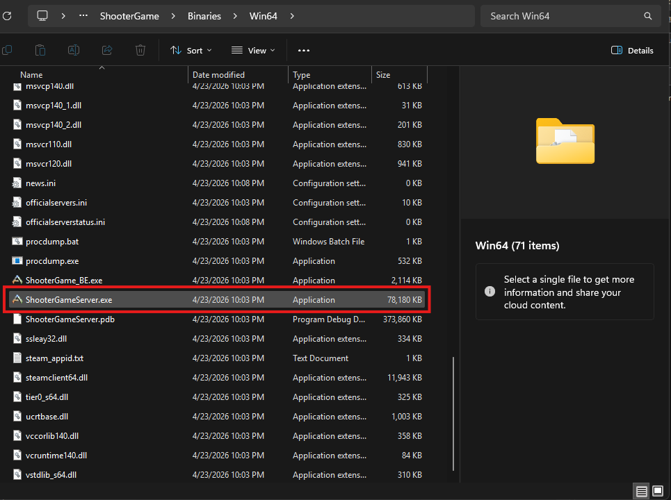
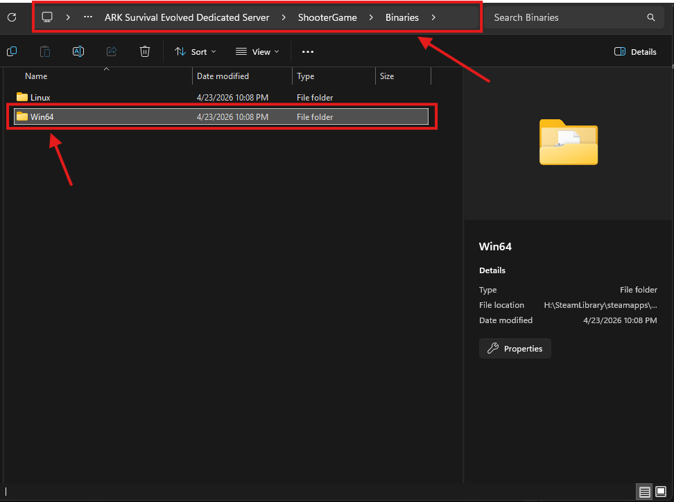
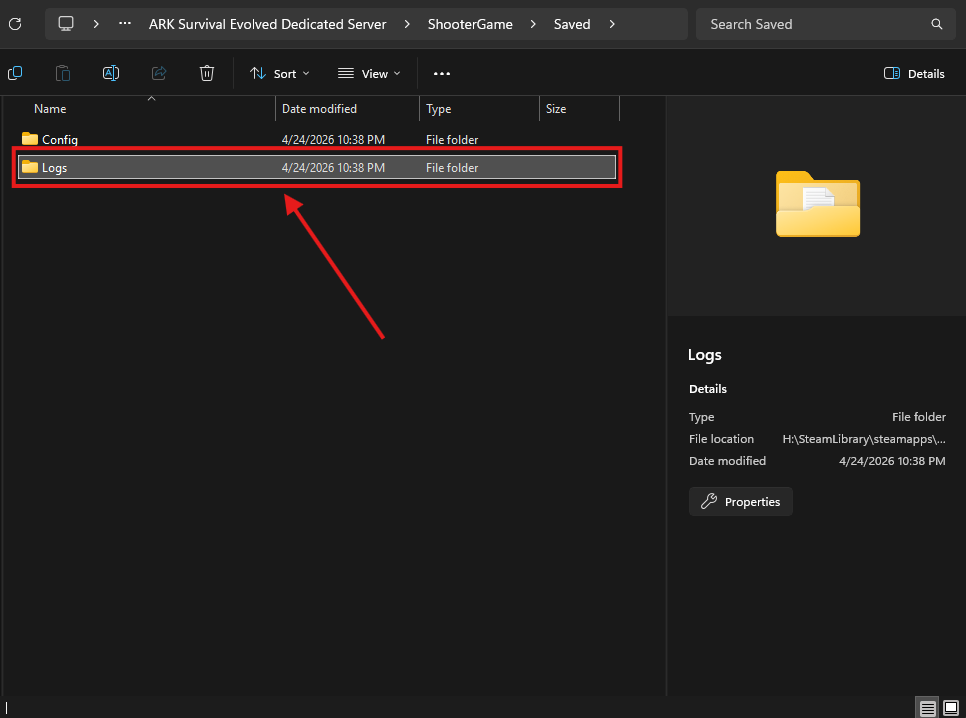
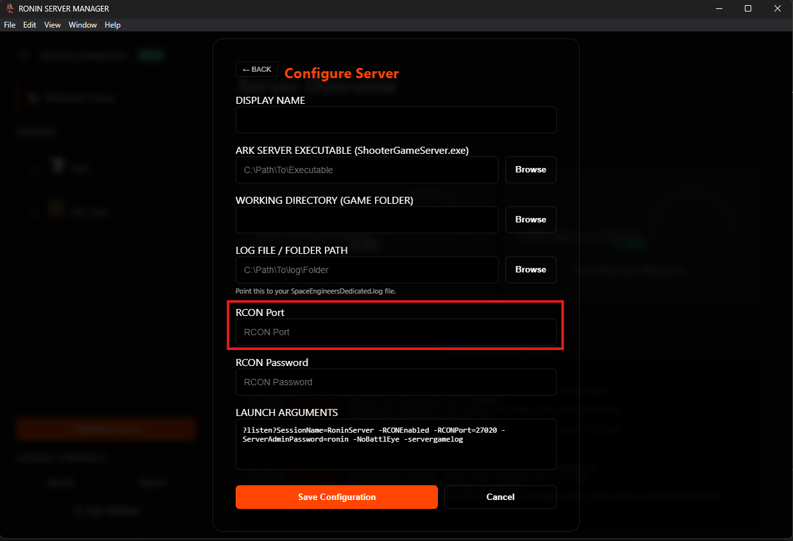
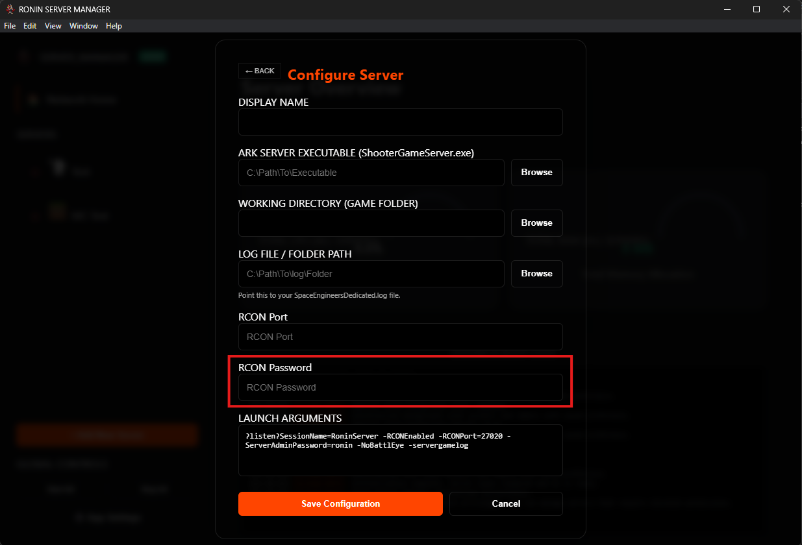
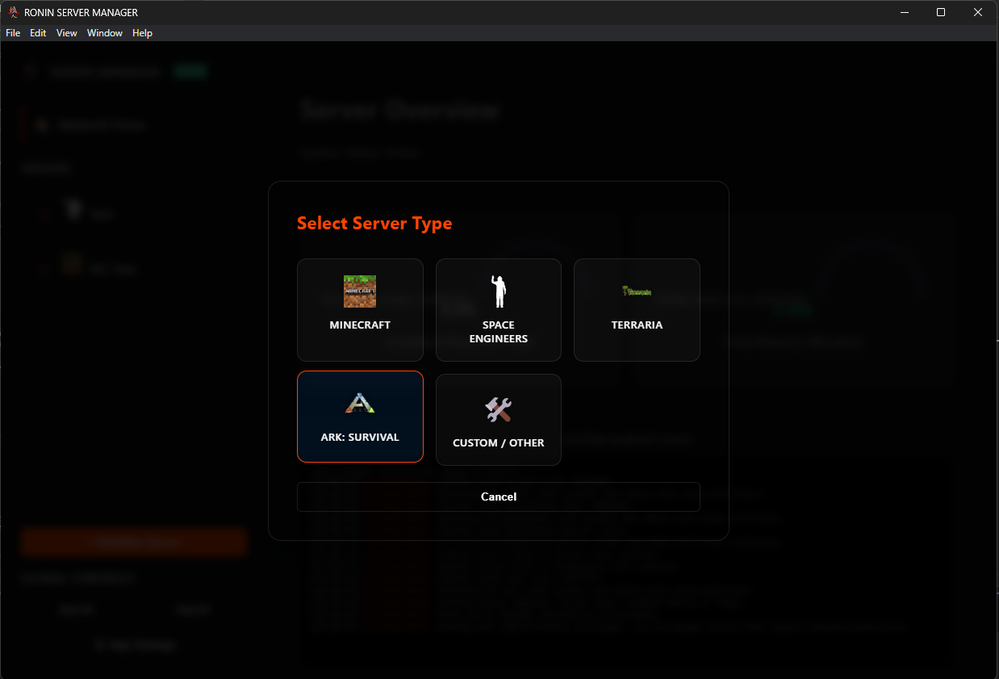

# material-paw: Ark: Survival {: .rsm-header }

!!! abstract "RCON & PowerShell Integration"
    Ark: Survival Evolved (and Ascended) runs as a persistent Windows process. Because it does not stream its console output to a standard window, RSM utilizes a **PowerShell Bridge** to tail the latest log files and uses the **RCON Protocol** to send administrative commands like kicks, bans, and broadcasts.

---

## ⚠️ Pre-Configuration Steps {: .rsm-header }

Ark requires specific launch flags to be active before RSM can communicate with it via RCON.

1.  **RCON Activation:** You must ensure `-RCONEnabled` is in your startup arguments. Without this, the Console tab in RSM will be "Read-Only."
2.  **Firewall Rules:** Ensure your RCON Port (Default: `27020`) is open in your Windows Firewall. RSM connects to this port locally to execute commands.
3.  **Log Generation:** By default, Ark might not save logs to the disk. Ensure `-servergamelog` is added to your arguments so RSM has a file to "tail."
4.  **File Location:** Locate these paths before starting the RSM Wizard:
    1.  __Server EXE:__ Usually located at `...\ShooterGame\Binaries\Win64\ShooterGameServer.exe`
    2.  __Working Directory:__ The `Win64` folder containing the executable.
    3.  __Log Folder:__ Usually located at `...\ShooterGame\Saved\Logs`
    4.  __RCON Port:__ Default is `27015` or `27020`.
    5.  __Admin Password:__ The password set via `-ServerAdminPassword`.

---

## 📂 Required Pathing {: .rsm-header }

While setting your servers settings (*before adding to RSM*) and doing your initial run of the server, be sure to remember or copy where these folder and files are so you have them ready when adding the server to RSM.

The most common locations are shown below, but they may differ based on your installation method (Steam, Epic, etc.) and custom configurations.

-   :material-file-code-outline: __Executable Path__

    ---

    Points to the binary.
    `...\Win64\ShooterGameServer.exe`

    

-   :material-folder-home-outline: __Working Directory__

    ---

    **Critical.** Must be the `Win64` folder so the server can find its sibling `.dll` files.

    

-   :material-text-search: __Log Path (Folder)__

    ---

    Points to the `Logs` **folder**. RSM will automatically scan this folder and "tail" the most recently created `.log` file.

    

-   :material-router-wireless: __RCON Port__

    ---

    **Required for Commands.** Match this to your `-RCONPort=` argument. This allows the RSM console to send commands.

    

-   :material-key-chain: __Admin Password__

    ---

    **Required for Commands.** This must match your `-ServerAdminPassword=`. RSM uses this to authenticate RCON sessions.

    

---

## ⚙️ Startup Arguments {: .rsm-header }

When using the Ark preset in RSM, your **Arguments** field should look similar to this to ensure compatibility:

| Flag | Function |
| :--- | :--- |
| `TheIsland?listen` | Sets the map and starts the listener. |
| `-servergamelog` | **Required.** Forces Ark to write console output to the log files RSM reads. |
| `-RCONEnabled` | **Required.** Opens the RCON communication channel. |
| `-RCONPort=27020` | Defines the port RSM uses to send commands. |
| `-ServerAdminPassword=...` | Sets the credentials for RSM to log in. |

---

## 
🚀 Adding to RSM

1.  **Open Manager:** Click **Add Server** and select the **Ark: Survival** card.

<i>Figure 1: Selecting Ark in the Registry</i>

2.  **Fill Fields:** Paste your `ShooterGameServer.exe` path. RSM will attempt to auto-fill the Working Directory for you.
3.  **Verify RCON:** Double-check that your `RCON Port` in RSM matches the one in your arguments string.
4.  **Save & Start:** Once saved, hit **Start**. 
    * *Note: Ark servers often take 30-60 seconds to create the first log file. If the console is blank initially, just wait for the server to finish "Primal Game Data" loading.*

---

## 🔍 Troubleshooting {: .rsm-header }

* **Console is empty:** Ensure `-servergamelog` is in your arguments. Check that the `Log Path` in RSM points to a folder containing `.log` files.
* **Commands don't work:** Verify the `Admin Password` matches your `-ServerAdminPassword`. Ensure the RCON port isn't being blocked by an Antivirus or Firewall.
* **Server crashes on Start:** Ensure the `Working Directory` is set to the `Win64` folder, not the base `Ark` folder. The executable needs to be "inside" its library environment to run.

---

  <i><b>Note:</b> Ark logs are "buffered" by the game engine. There may be a 2-5 second delay between an in-game action and it appearing in the RSM console.</i>

