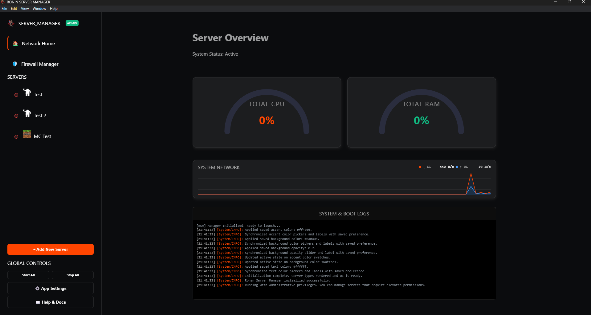

# 
🖥️ What Can RSM Do?

**Ronin Server Manager** is a local-first, Windows-native desktop app built to take the hassle out of running dedicated game servers. This page is a feature-by-feature walkthrough of everything it provides--from one-click server controls to integrated Windows Firewall management.

> Looking for setup instructions? Head to the [Getting Started](../getting-started.md) guide.

---

## 
📊 Home Dashboard

The home view is the nerve centre of RSM. At a glance you can see:

- **All managed servers**--name, status (Online / Starting / Offline), and current player count in a single list
- **Aggregate CPU & RAM**--live gauges showing combined resource use across every running server
- **System Bandwidth Graph**--a rolling network graph showing real-time receive and transmit rates for your whole machine
- **Global Controls**--start all, stop all, and access settings without switching views
- **System Log**--a live timestamped feed of every RSM event, error, and status change

The home view adds a **System Bandwidth Graph**--a dual-line rolling chart showing system-wide receive and transmit bytes per second sampled every 2 seconds.

---

## 
🚀 Server Management

Select any server in the sidebar to open its dedicated panel. From here you can:

-   :material-play-pause: **Start / Stop / Force Kill**

    ---
    One-click controls launch and shut down the server. The graceful stop sends the correct shutdown command for each game type. Force kill terminates the process immediately if it stops responding.

-   :material-console: **Live Console**

    ---
    See the server's output stream in real time and send commands directly via the input bar--no extra terminal window required. Output is colour-coded and scrollable.

-   :material-lightning-bolt: **Quick Actions**

    ---
    Per-game one-click buttons that fire common commands while the server is running--list players, save world, kick all, and more. Only shown for game types that support them.

-   :material-folder-open: **Open Folder**

    ---
    Jump straight to the server's working directory in Windows Explorer with a single click.

---

## 
📈 Real-Time Monitoring

Every server panel shows a live stats card with:

- **CPU %**--the server process's current CPU usage
- **RAM**--current RAM consumption and percentage of total system RAM
- **Connections Graph**--a faded background graph showing active ESTABLISHED TCP/UDP connections to the server process over the last 15 minutes, updating every 2 seconds
- **Player Count**--current connected players (for games with RCON or API support)
- **PID**--the operating system process ID for the running server
- **Uptime**--how long the server has been running since the last start

---

## 
✏️ In-App Config Editor

Click **Edit Config** in any server panel to open the server's configuration files directly inside RSM.

- **Tabbed interface**--switch between multiple config files (e.g. `GameUserSettings.ini` and `Game.ini` for Ark) without leaving the app
- **Line numbers** for easy navigation
- **Running-server warning**--a banner appears if you edit while the server is online; changes take effect after the next restart
- **Save / Discard**--write to disk or revert to the last saved state

Config files are resolved relative to the server's **Working Directory**. Games that store configs outside their install folder require an absolute path in the game's config definition.

---

## 
🛡️ Firewall Manager (Portier)

RSM includes an integrated Windows Firewall manager powered by the **Ronin Portier** engine. Firewall features are available in two places:

### Per-Server Firewall Ports Card

Every server panel shows a **Firewall Ports** card (for supported game types and pictured above) with:

- An editable row for each port the server uses--game port, query port, RCON, API, etc.
- TCP / UDP toggles per port
- A status indicator showing whether rules are currently active for this server
- **Apply Rules**--creates inbound Windows Firewall allow rules for every listed port in one click
- **Remove Rules**--removes all RSM-managed rules for this server
- **Save Changes**--saves any port number or protocol changes to the server's config

Port defaults are defined per game type but can be overridden per server instance and saved. Dont worry, these can be changed *before* any server is run. So you can make changes and edits without having to run and then stop the server.

### Firewall Manager View

The dedicated **Firewall Manager** view (*🛡️ Firewall Manager* in the sidebar) provides a full overview:

- **Managed Rules list**--every rule in the `Ronin Portier Rules` group, showing name, protocol, port, and enabled status with a per-row Remove button
- **Add Custom Rule**--create a one-off inbound rule with a custom name, port, and protocol without being tied to a specific server
- **Activity Log**--a timestamped console logging every add, remove, and error operation

!!! warning "Administrator Required"
    All firewall operations require RSM to be running with **Administrator privileges**. If you see an error in the activity log, re-launch RSM as Administrator. A green **Admin** badge in the top-left corner of the app confirms elevated mode.

---

## 
🎮 Supported Games

-   :material-zombie: **7 Days to Die**

    ---
    Direct console (stdin) with player count via `listplayers`, Telnet port recorded for external tools, config editor, and firewall ports (Game 26900, Telnet 8081, Control Panel 8080).

    [:octicons-arrow-right-24: View Guide](7-days-to-die.md)

-   :material-flask: **Abiotic Factor**

    ---
    PowerShell bridge. No RCON, no console commands (game limitation), config editor N/A (arguments only), firewall port (Game 7777, max 6 players).

    [:octicons-arrow-right-24: View Guide](abiotic-factor.md)

-   :material-paw: **Ark: Survival Ascended**

    ---
    Separate Steam app from Evolved, same RCON protocol. PowerShell bridge, config editor, and firewall ports (Game 7777, Query 27015, RCON 27020).

    [:octicons-arrow-right-24: View Guide](ark-survival-ascended.md)

-   :material-axe: **Ark: Survival Evolved**

    ---
    SteamCMD binary via PowerShell bridge. RCON for commands, config editor, and firewall ports (Game 7777, Query 27015, RCON 27020).

    [:octicons-arrow-right-24: View Guide](ark-survival.md)

-   :material-sword-cross: **Conan Exiles**

    ---
    SteamCMD binary via PowerShell bridge. RCON (lowercase commands) for player listing, config editor, and firewall ports (Game 7777, Peer 7778, RCON 25575).

    [:octicons-arrow-right-24: View Guide](conan-exiles.md)

-   :material-weather-fog: **Enshrouded**

    ---
    PowerShell bridge. No RCON, no console (game limitation), JSON config editor, and firewall ports (Game 15636, Query 15637).

    [:octicons-arrow-right-24: View Guide](enshrouded.md)

-   :material-minecraft: **Minecraft (Java)**

    ---
    Launched directly via `java.exe`. Full console I/O, Quick Actions, config editor, and firewall ports (Game 25565, RCON 25575).

    [:octicons-arrow-right-24: View Guide](minecraft.md)

-   :material-paw-off: **Palworld**

    ---
    PowerShell bridge. Player count via the REST API (RCON is deprecated), config editor, and firewall ports (Game 8211, REST API 8212). No console output -- see the guide.

    [:octicons-arrow-right-24: View Guide](palworld.md)

-   :material-brain: **Project Zomboid**

    ---
    Direct console + genuine RCON for player count (rare combination), config editor N/A (settings live in the user profile), and firewall ports (Game 16261, RCON 27015).

    [:octicons-arrow-right-24: View Guide](project-zomboid.md)

-   :material-pickaxe: **Rust**

    ---
    PowerShell bridge. RCON is WebRCON (WebSocket, natively supported), config editor, and firewall ports (Game 28015, Query 28017, WebRCON 28016). Player count and Quick Actions both work.

    [:octicons-arrow-right-24: View Guide](rust.md)

-   :material-factory: **Satisfactory**

    ---
    PowerShell bridge. Player count via the HTTPS API on the same port as the game, mostly in-game configuration, and firewall ports (Game/API 7777, Beacon 15000).

    [:octicons-arrow-right-24: View Guide](satisfactory.md)

-   :material-pine-tree: **Sons of the Forest**

    ---
    PowerShell bridge. No RCON (game limitation), config editor N/A (arguments only), and firewall ports (Game 8766, Query 27016, Blob Sync 9700).

    [:octicons-arrow-right-24: View Guide](sons-of-the-forest.md)

-   :material-drama-masks: **Soulmask**

    ---
    PowerShell bridge. RCON for player count (previously unexposed in this config), config editor N/A (arguments only), and firewall ports (Game 7777, Query 27015, RCON 19000).

    [:octicons-arrow-right-24: View Guide](soulmask.md)

-   :material-rocket-launch: **Space Engineers**

    ---
    Native Windows binary via PowerShell bridge. Headless background launch, VRage HTTP API for commands and player counts, config editor, and firewall ports (Game 27016 UDP, API 8080).

    [:octicons-arrow-right-24: View Guide](space-engineers.md)

-   :material-sword: **Terraria**

    ---
    Launched directly via `TerrariaServer.exe`. Full console I/O with player count via `playing`, config editor, and firewall ports (Game 7777 TCP).

    [:octicons-arrow-right-24: View Guide](terraria.md)

-   :material-bat: **V Rising**

    ---
    PowerShell bridge. RCON for admin commands (no player-list support), config editor, and firewall ports (Game 9876, Query 9877, RCON 25575).

    [:octicons-arrow-right-24: View Guide](v-rising.md)

-   :material-axe-battle: **Valheim**

    ---
    PowerShell bridge. No RCON (game limitation), config editor N/A (arguments only), and firewall ports (Game 2456-2458 UDP).

    [:octicons-arrow-right-24: View Guide](valheim.md)

-   :material-wrench: **Custom / Other**

    ---
    Generic setup for any game not listed. Fill in only the fields your server needs. Uses `DIRECT_CONSOLE` mode by default.

    [:octicons-arrow-right-24: Getting Started](../getting-started.md)

---

## 
➕ Adding a New Game Type

RSM is built to be extended. Adding support for a new game involves creating a config file, dropping in an icon, and registering it in the index--no changes to the core engine needed. See the [Contributing Guide](../contributing.md) for a full step-by-step walkthrough.
