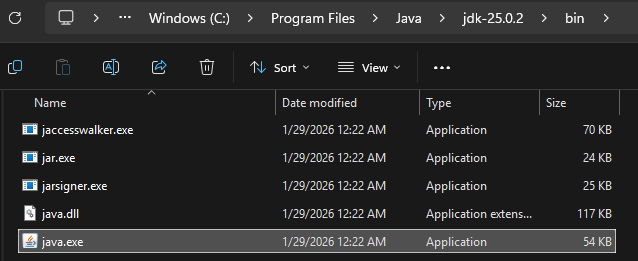
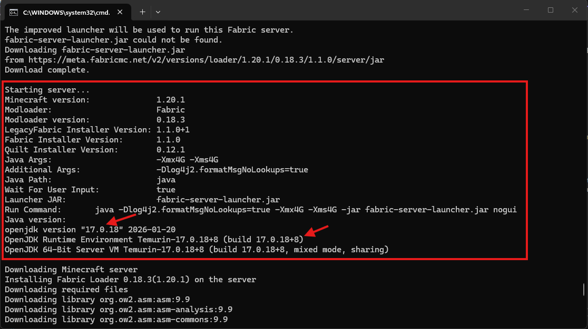
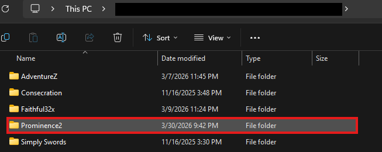
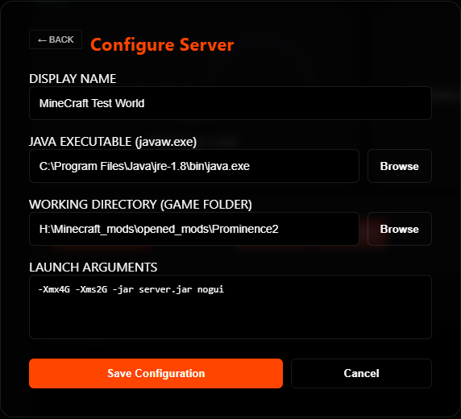
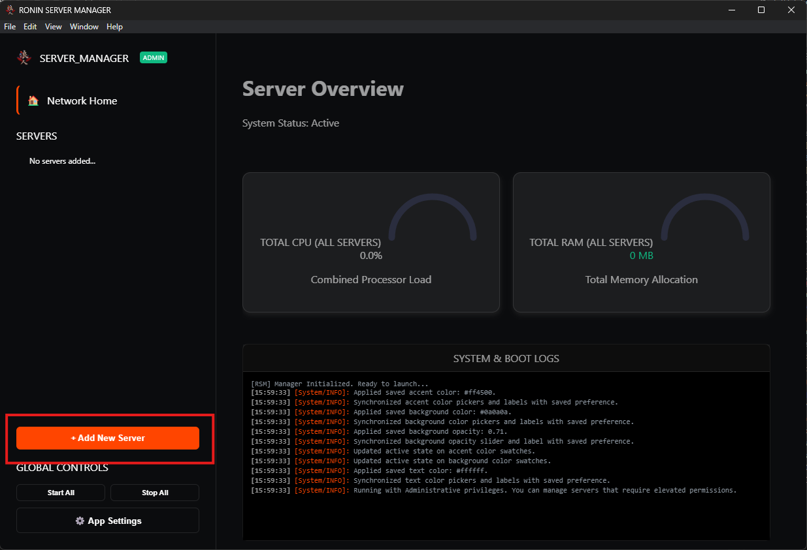
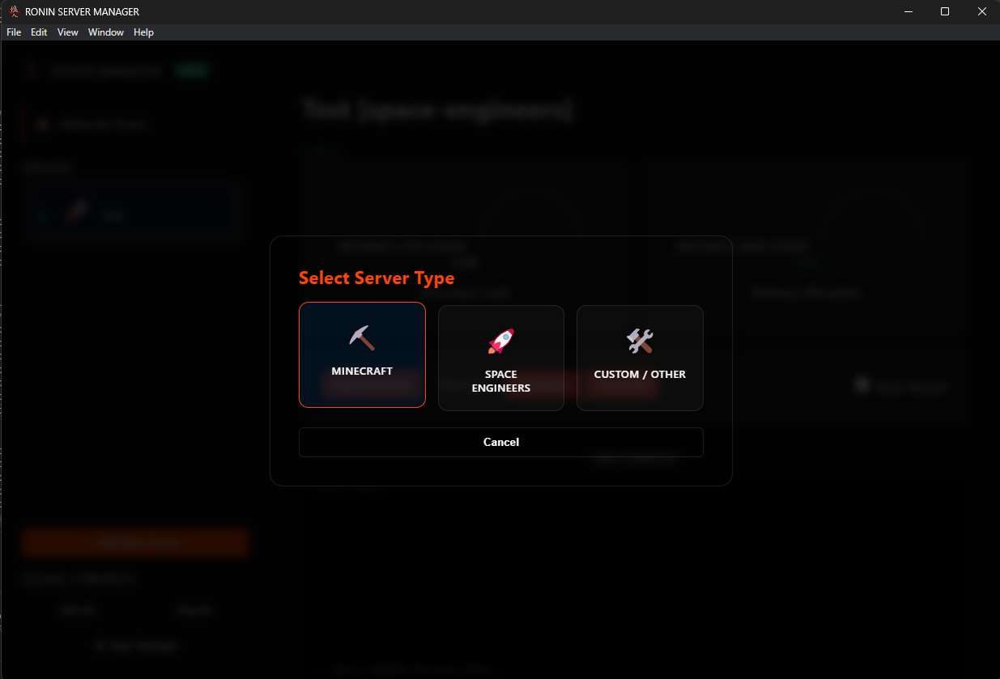

# material-pickaxe: Minecraft Server {: .rsm-header }

!!! abstract "Java-Based Integration"
    Minecraft runs via the Java Runtime Environment (JRE). Unlike native executables, RSM interacts with Minecraft by capturing its standard input/output streams directly.
    This allows for near-instant console responses and direct command injection without the need for an external API.

---

## ⚠️ Pre-Configuration Steps {: .rsm-header }

Before adding the Minecraft server to RSM, you must stage the Java environment and the EULA.
We also want to ensure we capture the correct Java version and working directory for the server.

1.  **Java Check:** Ensure you have the correct JDK installed (Java 17, or 21 is recommended for modern versions). Run `java -version` in a terminal to confirm.
2.  **EULA Acceptance:** Run your `server.jar` manually once. It will fail and create a `eula.txt` file. Open this file and change `eula=false` to `eula=true`.
3.  **Server Properties:** Edit `server.properties` to set your desired port (Default is `25565`) and query settings.
4.  **File Location:** Identify the following paths before adding the server to RSM:

    1. __Java Executable:__ Usually located at `C:\Program Files\Java\jdk-21\bin\java.exe` (May be different based on your modpack and minecraft version)
    2. __Working Directory:__ The folder containing your `server.jar` and `mods`. This will usually be the server folder you have set up for your Minecraft server. `C:\Servers\VanillaPlus`

### ☕ Identifying your Java Path {: .rsm-header }

=== ":material-folder-search: Manual Method"
    1.  **Locate Installation:** Usually in `C:\Program Files\Java\`.
    2.  **Find the Bin:** Open your version folder (e.g., `jdk-21`) and open the `bin` folder.
    3.  **Copy Path:** Right-click `java.exe` and select **"Copy as path"**.
    

=== ":material-console: Log Method"
    1.  Run your server manually once.
    2.  Look for a log line like: `Starting Server...`
    3.  Some will have an exact file path, others will give a generic `Java` call
    4.  Copy that exact path into the RSM **Path** field.
    

---

## 📂 Required Pathing {: .rsm-header }

-   :material-coffee: __Java Executable__

    ---
    Points to the `java.exe` binary. Do not point to the .jar here.
    `...\bin\java.exe`

    

-   :material-folder-home: __Working Directory__

    ---
    **Critical.** The folder where the world and mods live.
    `C:\Servers\VanillaPlus`

    

-   :material-memory: __Max RAM (GB)__

    ---
    The maximum memory the server can use. Only change the number part for each in the arguments field, the rest of the syntax should be the same.
  - For example, if you want to set 4GB of RAM, you would use `-Xmx4G` and `-Xms4G` in the arguments field.

    

-   :material-console: __Direct Input__

    ---
    **Supported.** Unlike SE, Minecraft accepts commands directly via the RSM console without an API password.
    This way we won't need to set up a separate RCON password for the server, we can just send commands directly from the RSM console.

---

## ⚙️ Startup Arguments {: .rsm-header }

Since you are using manual arguments in the RSM Wizard, ensure your **Arguments** field follows this syntax to avoid boot failures:

| Flag | Function |
| :--- | :--- |
| `-Xmx...G` | Sets the maximum memory (e.g., `-Xmx4G`). |
| `-Xms...G` | Sets the starting memory (should match Max RAM). |
| `-jar ...` | Points to your server file (e.g., `-jar server.jar`). |
| `nogui` | **Required.** Disables the default Minecraft GUI window. |

---

## ⛏️ Adding to RSM {: .rsm-header }

1.  **Open Manager:** Click **Add Server** and select the **Minecraft** card.

<i>Figure 1: Clicking 'Add Server' in RSM</i>

<i>Figure 2: Selecting Minecraft</i>

2.  **Fill Fields:** Use the Java path and Working Directory identified above. Paste your manual arguments string into the Arguments field.

<i>Figure 3: Inputting Java and RAM Info</i>

3.  **Save:** Click **Save Server**. The server will appear in your sidebar with the :material-pickaxe: icon.
4.  **Launch:** Select the server and hit **Start**. RSM will capture the Java stream and begin displaying logs immediately.

---

  <i><b>Note:</b> Ensure your Working Directory is correct. If the server starts and stops instantly, check that your <b>eula.txt</b> is set to true in that folder.</i>

