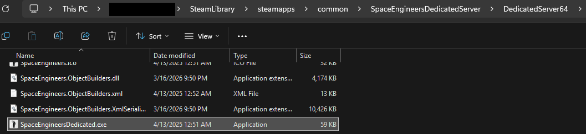
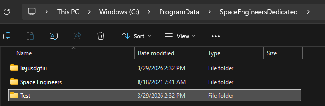
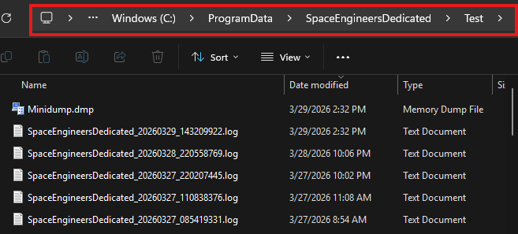
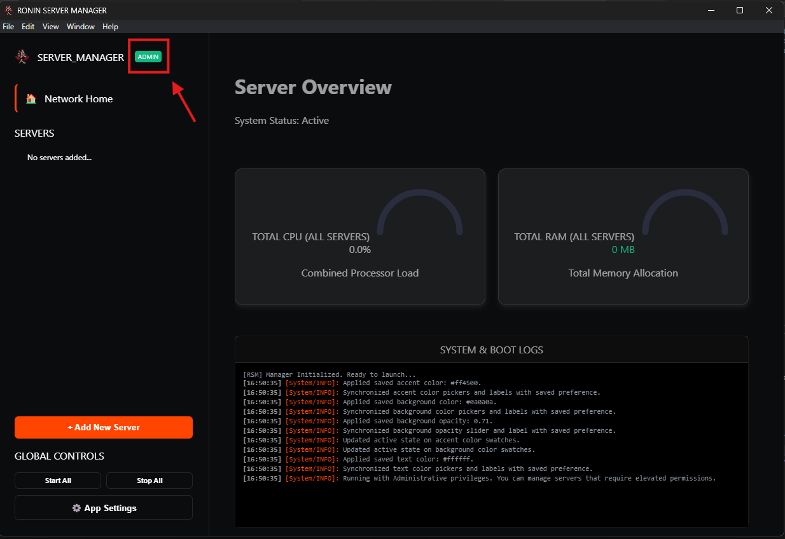
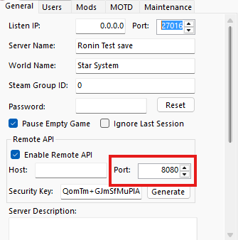
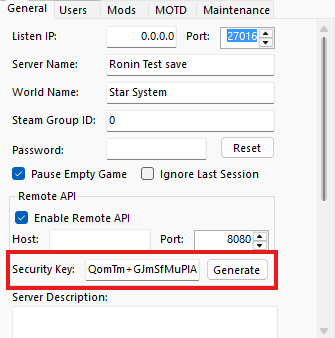
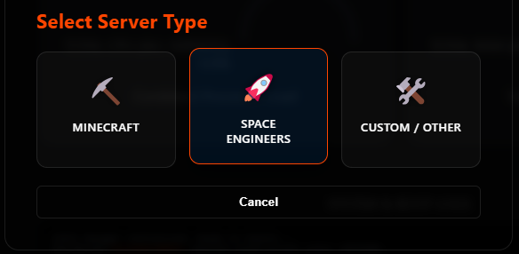
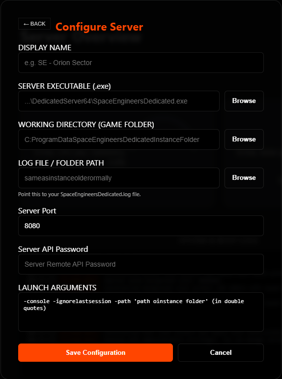

# material-rocket-launch: Space Engineers {: .rsm-header }

!!! abstract "High-Performance Integration"
    Space Engineers runs as a native Windows executable. Unlike Java-based games, RSM interacts directly with the SE binary and monitors the world state by "tailing" the physical log files in real-time. This ensures that even without a direct standard-out stream, your RSM Dashboard stays updated.

---

## ⚠️ Pre-Configuration Steps {: .rsm-header }

Before adding the server to RSM, you must perform a "Clean Boot" to stage the environment.

1.  **First Run:** Launch `SpaceEngineersDedicated.exe` manually. Configure your World Settings and run the server to ensure everything starts correctly.
2.  **Mod Sync:** After running the initial configuration, Add your mods, and start the server and wait for all mods to download. Ensure the console reaches the `Game is Ready` state.
3.  **Argument Watching:** When yoiu launch the server the last time, keep an eye on the arguments it starts with. They will be at the top of the console. We will use these arguments by default, but it is a good way to ensure they are the correct ones to use.
4.  **File Location:** Be sure you find the location of the following file locations for the server. You will need these when adding it to the RSM:

    1. __Server EXE:__ Usually located at `C:\SteamLibrary\steamapps\common\SpaceEngineersDedicatedServer\DedicatedServer64\SpaceEngineersDedicated.exe`
    2. __Instance Folder:__ Usually located at `C:\ProgramData\SpaceEngineersDedicated\InstanceFolder`
    3. __Log Folder:__ Same as instance usually, but can be different so we grab it anyway `C:\ProgramData\SpaceEngineersDedicated\InstanceFolder`
    4. __Server IP Port__ This is the port you will end up using for the server. Default is 8080
    5. __Server API Password__ This is the password to access the API, You will need this to type console commands.  

---

## 📂 Required Pathing {: .rsm-header }

-   :material-file-document-edit-outline: __Executable Path__

    ---
    Points directly to the dedicated server binary.
    `...\DedicatedServer64\SpaceEngineersDedicated.exe`

    

-   :material-folder-zip: __Instance Directory__

    ---
    The folder containing your Saves and Storage.
    `C:\ProgramData\SpaceEngineersDedicated\MyInstance`

    

-   :material-text-box-search-outline: __Log Path__

    ---
    Usually the same as the Instance folder. RSM reads the latest `.log` file here to mirror the console.

    

-   :material-shield-check: __Admin Privileges__

    ---
    **Required.** SE must bind to network ports. Ensure the RSM "Admin Badge" is green before starting.

    

-   :material-import: __Server Port__

    ___
    **Required For Console Commands** SE uses the axius API to send commands to the server. We will need the port to send commands to the correct server.

    

-   :material-export: __Server API Password__

    ___
    **Required For Console Commands** Since we want to send commands as *Admin*, We need the "*API Security Key*" to send the commands

    

---

## 
⚙️ Startup Arguments

When using the Space Engineers preset in the RSM Wizard, ensure these flags are present in the **Arguments** field to ensure the server starts correctly:

| Flag | Function |
| :--- | :--- |
| `-console` | Enables the text stream RSM uses for logging. |
| `-ignorelastsession` | Automatically clears "unclean shutdown" popups. |
| `-path "..."` | Same path as to your Instance folder. |

---

## 
🚀 Adding to RSM

1.  **Open Manager:** Click **Add Server** and select the **Space Engineers** card.

<i>Figure 1: Clicking 'Add Server' in RSM</i>

<i>Figure 2: Selecting Space Engineers</i>

2.  **Fill Fields:** Use the paths identified above. RSM will automatically suggest common SE arguments.

<i>Figure 3: Inputing Information</i>

3.  **Save:** Click **Save Server**. The server will appear in your sidebar with the :material-rocket-launch: icon.
4.  **Launch:** Select the server and hit **Start**. RSM will begin tailing the logs immediately.

---

  <i><b>Note:</b> Because RSM reads from the physical disk log, a 1-2 second delay in console output is normal for Space Engineers.</i>

