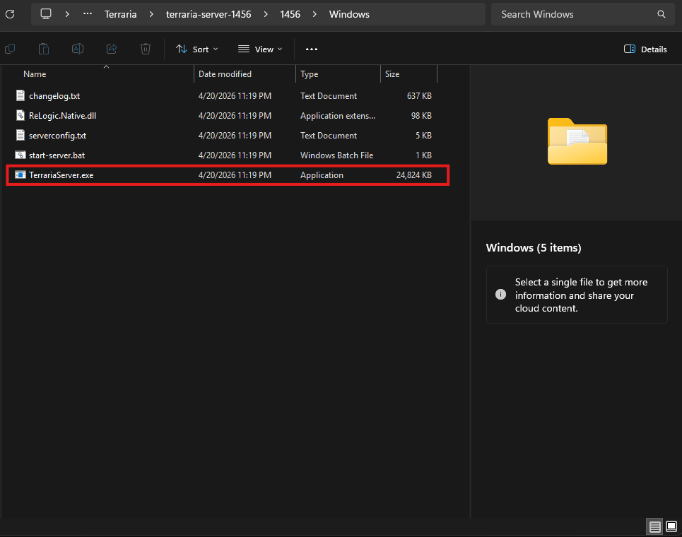
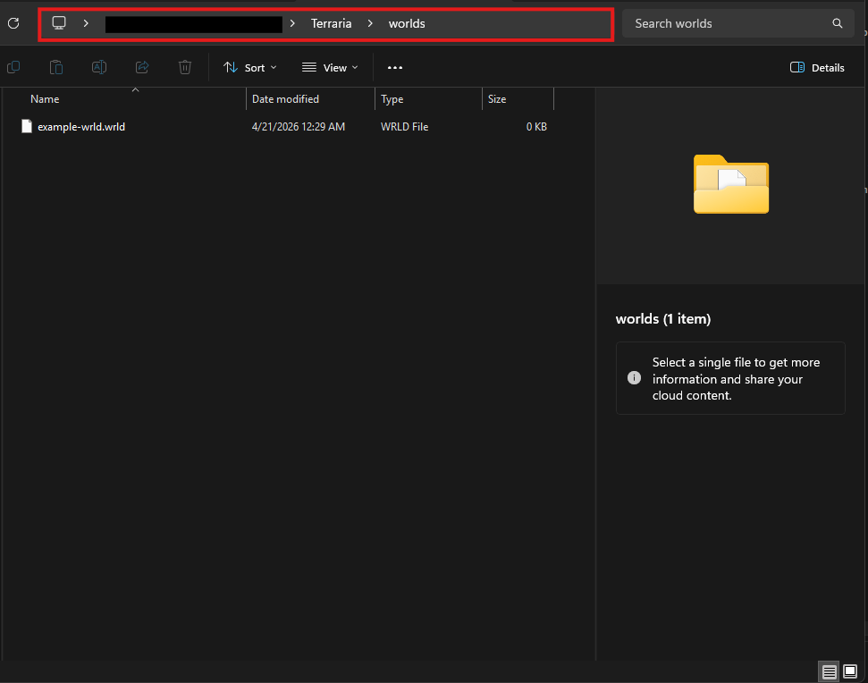
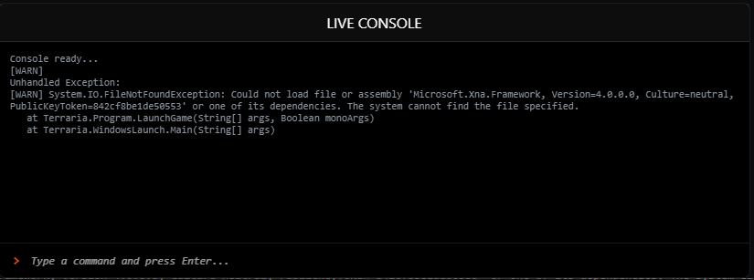
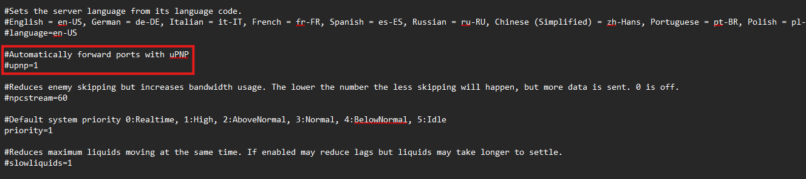
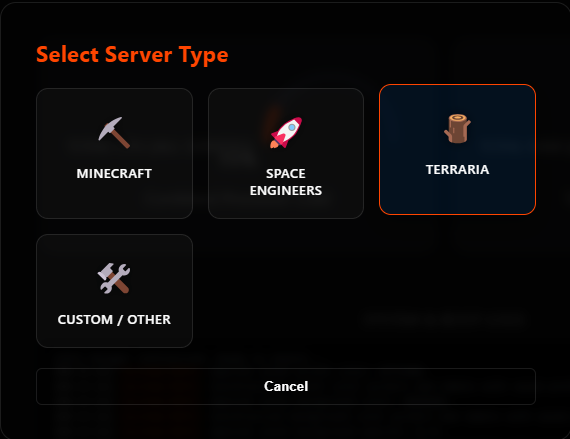
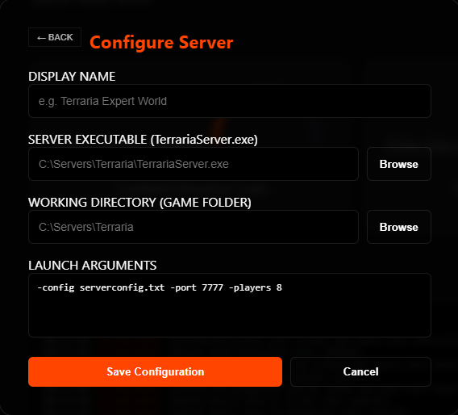

# :material-tree: Terraria {: .rsm-header }

!!! abstract "Direct Console Integration"
    Terraria runs as a native Windows executable. RSM utilizes a "Direct Console" approach, piping the standard input and output streams directly into the dashboard. This allows for real-time interaction with the server's startup prompts and world-management commands without needing external log files or APIs.

[Get Terraria Server Files :material-download:](https://terraria.org/){ .md-button .md-button--primary }

---

## ⚠️ Pre-Configuration Steps {: .rsm-header }

Before adding the server to RSM, ensure the host environment is prepared for the XNA Framework.

1.  **System Dependencies:** Terraria requires the **Microsoft XNA Framework Redistributable 4.0**. If the `redist` folder is missing from your server files, download it directly from Microsoft: [XNA 4.0 Redistributable Refresh](https://www.microsoft.com/en-us/download/details.aspx?id=27598).
2.  **World Generation:** While RSM can handle the startup prompts, it is recommended to run `TerrariaServer.exe` manually once to generate your initial world and set the max players/port settings.
3.  **Config Files:** For a fully automated "One-Click" startup, create a `serverconfig.txt` file in your server directory. This allows the server to skip interactive questions and go straight to "Online" status.
4.  **File Location:** Identify the following paths for the RSM Wizard:
    1.  __Server EXE:__ Usually `TerrariaServer.exe`.
    2.  __Working Directory:__ The root folder containing your server files and config.

---

## 🛠️ Troubleshooting Dependency Errors {: .rsm-header }

If the server fails to launch or the console displays a `FileNotFoundException` immediately after starting, follow these steps:

### Missing XNA Framework
The most common error is a missing `Microsoft.Xna.Framework` assembly. 
* **Fix:** Run the XNA 4.0 Refresh installer linked above. 
* **Note:** You may also need the [.NET Framework 3.5 Runtime](https://www.microsoft.com/en-us/download/details.aspx?id=21) enabled on your system for older versions of the Terraria server.

### Legacy Component Support (DirectPlay)
On Windows Server or fresh Windows 10/11 installs, legacy network components may be disabled by default.
1.  Open **Control Panel** > **Programs and Features**.
2.  Select **Turn Windows features on or off**.
3.  Expand **Legacy Components** and check **DirectPlay**.
4.  Click **OK** and restart the server through RSM.

---

## 📂 Required Pathing {: .rsm-header }

-   :material-file-document-edit-outline: __Executable Path__

    ---

    Points directly to the Terraria binary.
    `...\Terraria\TerrariaServer.exe`

    

-   :material-folder-zip: __Working Directory__

    ---

    The folder where your config files and world data live.
    `C:\Servers\Terraria`

    

-   :material-console: __Direct Console__

    ---

    **Standard Out.** Unlike SE, Terraria does not require a Log Path. RSM captures the window output directly.

    

-   :material-shield-check: __Admin Privileges__

    ---

    **Recommended.** Required if the server needs to automatically open ports via UPnP or bind to protected network sockets.

    

---

## ⚙️ Startup Arguments {: .rsm-header }

When using the Terraria preset in the RSM Wizard, these flags are commonly used to automate the launch process:

| Flag | Function |
| :--- | :--- |
| `-config serverconfig.txt` | Loads server settings from a text file to skip manual prompts. |
| `-port 7777` | Specifies the listening port (Default is 7777). |
| `-players 8` | Sets the maximum number of simultaneous players. |
| `-world "..."` | Points to a specific `.wld` file to load automatically. |

---

## 
🌳 Adding to RSM

1.  **Open Manager:** Click **Add Server** and select the **Terraria** card.

<i>Figure 1: Selecting Terraria in the RSM Wizard</i>

2.  **Fill Fields:** Fill in the fields with the appropriate paths and settings for your Terraria server. Replace the "serverconfig.txt" argument with your actual config file if you created one in the pre-configuration steps, or just leave it alone for the default server set-up. Rsm will automatically suggest common Terraria arguments.

<i>Figure 2: Inputting Executable and Working Directory</i>

3.  **Save:** Click **Save Server**. Your server will appear in the sidebar with the :material-tree: icon.
4.  **Launch:** Select the server and hit **Start**. You can respond to any startup prompts directly through the RSM Console Input.

---

  <i><b>Note:</b> If the console stays blank but the CPU gauge is active, ensure you are not running the server in a "GUI" mode that detaches the process from the terminal.</i>

